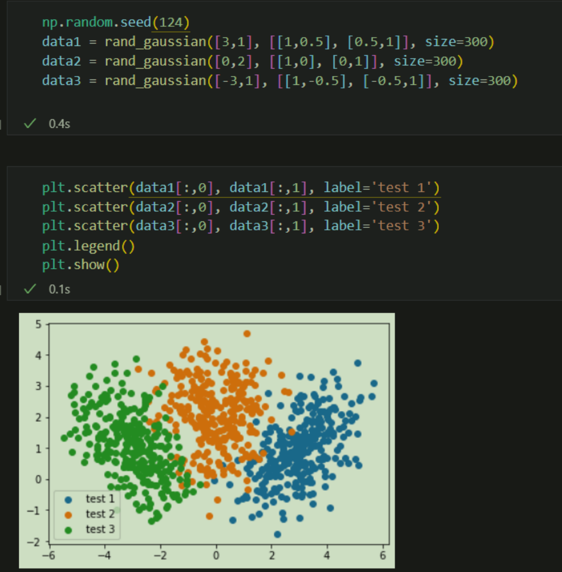
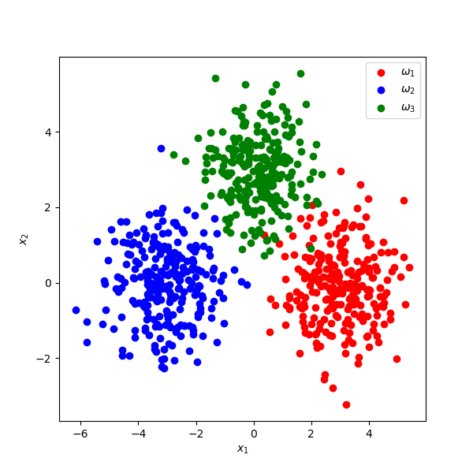
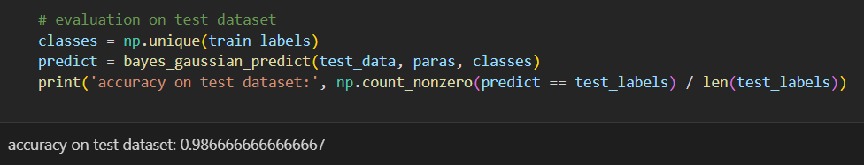
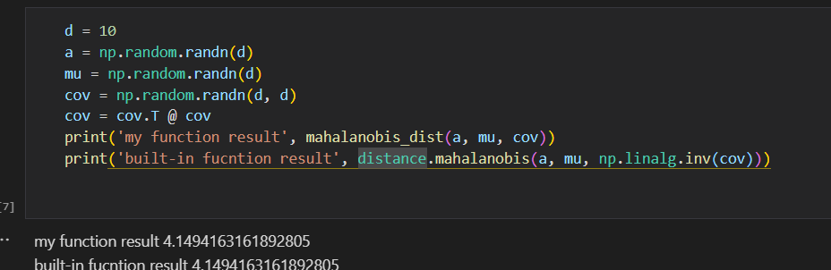
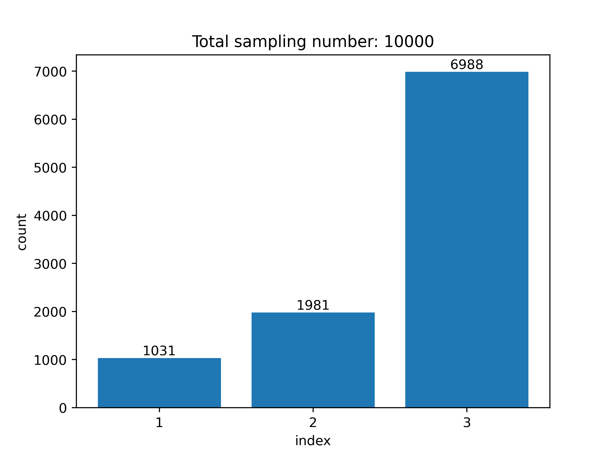

# Homework 1: Machine Learning

> Date: 2022-01-23

## 1. Probability and Discriminant Classifiers (Analysis)

**Part I**
$$
P(\omega_{\rm{max}}|x)\geq P(\omega_i | x), \textrm{ for } i=1,\cdots,C
$$

Since $\sum_i P(\omega_i | x) = 1$, $P(\omega_{\rm{max}})\geq \frac{1}{C}$ is obviously

Using 0-1 loss function, 
$$
L\left( \omega, \hat{\omega} \right) =\left\{ \begin{array}{c}
	1, \omega \ne \hat{\omega}\\
	0, \omega = \hat{\omega}
\end{array} \right. 
$$
Then 
$$
\begin{align}

P_{\rm{err}} &= E_X \left(\sum_{i=1}^C L(\omega_1, f(x)) P(\omega_i|x)\right)\\
&= \int_x p(x)\sum_{i=1}^C L(\omega_1, f(x)) P(\omega_i | x)\textrm{d} x\\
&= \int_x p(x) (1-P(\omega_i | x))\textrm{d} x\\
&\leq \int_x p(x) (1 - \frac{1}{C})\textrm{d} x
= 1 - \frac{1}{C}
\end{align}
$$
**Part II**

The posterior probability $P(\omega_j | x) = \frac{P(\omega_j)P(x|\omega_j)}{P(x)}$.

For $x$, $\hat{\omega}_j = \textrm{arg max}P(x|\omega_j)$

Denote $||x||_1 = \sum_{i=1}^d |x_i|  = \sum_{i=1}^d |x_i| =\leq d$, which means there are $m$ non-zero entries of vector $x$

Then 
$$
P(x|\omega_i) = \prod_{i=1}^d P(x_i | \omega_1) =p_{i1}^m (1-p_{i1})^{d-m}=p^m (1-p)^{d-m}
$$

Similarly, $P(x|\omega_2) = (1-p)^m p^{d-m}$

Thus,
$$
\begin{align}
&\quad P(x|\omega_1)\geq P(x|\omega_2)\\
&\Leftrightarrow \left(\frac{p}{1-p}\right)^m\geq \left(\frac{p}{1-p} \right)^{d-m}\\
&\Leftrightarrow m \geq d -m\\
&\Leftrightarrow m \geq \frac{d}{2}
\end{align}
$$
So, choose $\omega_1$ if $||x||_1 = \sum_{i=1}^d x_i \gt \frac{d}{2}$; otherwise, choose $\omega_2$.

**Part III**
$$
P_b = P(\textrm{ boy}) = \frac{1}{2},\quad P_g = P(\textrm{girl}) = \frac{1}{2}
$$
"Your sibling is male or female" is an event independent with your sex, so
$$
P(\textrm{you have a brother})=\frac{1}{2}
$$
**Part IV**
$$
P(x|\omega_i)\sim N(\mu_i,\sigma^2 I)
$$

$$
\begin{align}
g_i(x) &= \log (p(x|\omega_i)p(\omega_i)\\
&= -\frac{1}{2}(x-\mu_i)^T \Sigma_i^{-1} (x-\mu_i) - \frac{d}{2}\log 2\pi - \frac{1}{2}\log |\Sigma_i| + \log p(\omega_i)
\end{align}
$$

Obviously, $\Sigma_i^{-1} = \frac{I}{\sigma^2}$, $|\Sigma_i| = \sigma^{2d}$

Then, $g_i(x) = -\frac{1}{2\sigma^2}(x-\mu_i)^T (x-\mu_i) - \frac{d}{2}\log 2\pi - d\log\sigma + \log p(\omega_i)$, 

in which $(x-\mu_i)^T (x-\mu_i) = x^T x - \mu_i^T x - x^T\mu_i + \mu_i^T\mu_i$

Therefore, in the form of $g_i(x) = w_i^T x + w_{0i}$,
$$
w_i = x-\mu_i,\quad w_{0i} = -x^T\mu_i + \mu_i^T\mu_i - \frac{d}{2}\log 2\pi - d\log\sigma + \log p(\omega_i)
$$

## 2. Linear and Quadratic Classifier (Code)

The following just demonstrates key results of each problem, while more detailed results could be found in the `hw1.ipynb` file.

**Part I: Random normal distribution**

e.g. 2-D random distribution result based on the implemented function named *rand_gaussian*.



**Part II: Discriminant function**

This function is implemented and is  to coding solutions to problem-3 and problem-5. It is verified correctly

**Part III: 2-D data**



By randomly generate 200 training samples and 50 testing samples, we get about 98% accuracy on the test dataset.



**Part IV: Mahalanobis distance**



Comparing the self-implemented Mahalanobis distance calculation function and the built-in function of *scipy,* the results are the same.

**Part IV: Naive Bayes Classifier from scratch**

We use the following different parameters to verify the self-implemented Bayes Classifier and compare it with the built-in Gaussian Bayes Classifier from *scikit-learn.* 

The data generation part of program are as follows, i.e., the random seed is fixed, while the *means, variances* and *prior probabilities* are all generated randomly based on regulatable feature dimension 𝑑𝑑 and class number 𝐶𝐶. The sizes of training and testing samples are 2000 

and 500, respectively.

Settings:

```python
# generate data randomly
np.random.seed(123)
d = 10 # number of features
C = 10 # number of classes, [1, 1, ..., C]

mu_list = [np.random.randn(d) for c in range(C)]
cov_list = [np.diag(np.random.rand(d) * 3) for c in range(C)]

prior_probs = np.random.rand(10)
prior_probs = prior_probs / np.linalg.norm(prior_probs, 1)
```

Results:

| Feature dimension | Class number | Accuracy (self-implemented) | Accuracy (built-in) |
| ----------------- | ------------ | --------------------------- | ------------------- |
| 5                 | 5            | 0.87                        | 0.85                |
| 5                 | 10           | 0.81                        | 0.78                |
| 10                | 10           | 0.937                       | 0.912               |
| 10                | 20           | 0.882                       | 0852                |
| 20                | 20           | 0.979                       | 0.968               |

Of course the correctness of self-implemented Naïve Bayes Classifier is applicable, and it is seemingly more “effective” than the built-in *GaussianNB* model of *scikit-learn*.

## 3. Misc Code (Part II) — Sampling from a distribution

To acquire a sampling result from $\mathcal{N}$ with respect to probabilities distribution vector $\mathbf{p}=[p_1,\cdots,p_n]$. Firstly, acquire the cumulative distribution function $F(n)$ by cumulate-summating the PMF functions, then sample from standard uniform distribution to obtain a random number $n\in [0,1]$ . According to the interval of where 𝑛𝑛 was located, the sampled index $i\in \left\{1,\cdots,N \right\}$ could be determined. Specifically, in ascending order of cumulative distribution function 

appended $n$, if we get
$$
[p_1,\cdots, n,\sum_{k=1}^i p_k, \cdots, 1],
$$
we should make index $i$ as the sampling result from $\mathcal{N}$.

Using the self-implemented sampling function, I make a sampling for 10000 times based on a distribution 
$$
P\left( N=n \right) =\left\{ \begin{array}{c}
	0.1, n=1\\
	0.2, n=2\\
	0.3, n=3\\
\end{array} \right. ,
$$
a result as the following shows was obtained (`numpy.random.seed(1234)`).


