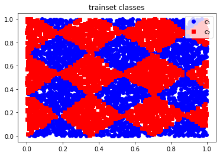
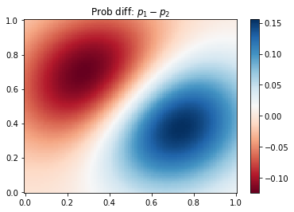
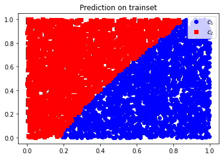

# Homework 2: Machine Learning

> Date: 2022-02-16

## 1. Linear Classifier with a Margin

Given two sample points, the dataset must be linearly discriminative, then the max-margin hyperplane exists and it is unique. The two points are both corresponding "Supporting Vectors". Constraints are

$$
w\cdot x_1 + b = 1,\quad w\cdot x_2 + b= -1.
$$

The value of "margin" is $2/||w||$, herein L2 norm is applied. Maximizing the margin means the additive projective distances of $x_1$ and $x_2$ to the hyperplane is maximized, that is, the "straight-line" distance. So he normal vector of such hyperplane is along with $x_1 - x_2$, thus ($x_1$ is the positive-case point)

$$
w \propto x_1 - x_2.
$$
While the margin value $2/||w||$ is exactly the distance between $x_1$ and $x_2$, i.e., $\frac{2}{||w||}=||x_1-x_2||$,
therefore,
$$
w = \frac{2(x_1 - x_2)}{||x_1-x_2||^2}.
$$

The midpoint $\frac{x_1 + x_2}{2}$ is naturally located on the hyperplane, that is,
$$
0=w\cdot \frac{x_1+x_2}{2}+b\Rightarrow b=\frac{||x_2||^2-||x_1||^2}{||x_1 - x_2|^2}.
$$

## 2. Linear Regression with Regularization

**L2 regularization**

Adding the regularization item, s.t. 
$$
\textrm{argmin}\sum_i (w^T x_i - y_i)^2+\lambda ||w ||_2^2
$$

The solution with L2 regularization will avoid overfitting to some extent. Because the optimization orientation considers miniaturization of weight parameters $w$, the model function will become more "smooth" than that without regularization. If the trained function consider almost all information of the train dataset, it will inevitably perform not well in unkown testing dataset, while L2 penalty reduces this kind of overfitting risk.

Adding the L2 penalty makes optimization process more stable and quick, since the above formula satisfies the "strong convexity".  

**Self-implemented Logistic regressor**

- Dataset: [Titanic](data/titanic.csv), [Bank](data/bank.csv)
- Loss function: Cross-entropy loss
- Optimization: Stochastic Gradient Descent (SGD)

The dataset is some real-world data ([ECE 523 Github dataset](https://github.com/gditzler/UA-ECE-523-Sp2018/tree/master/data)).

The source code in `logistic_regression.py` in current folder implements my Logistic regressor. Its core functionalities are implemented member methods `fit()` and `predict()` in the self-defined class `LogisticRegressor`. Herein I let the self-implemented class extend the built-in base class `BaseEstimator` just for better pipeline operation when using. 

The binary cross-entropy loss 

$$
L=-\frac{1}{N}\sum_i^N y_i \log{\hat{y_i}}+(1-y_i)\log{(1-\hat{y_i}})
$$

is used for optimization $\hat{w} = \textrm{argmin}$ $L$. The gradients of parameters are calculated analytically and parameters get updated step by step.

$$
b^{t+1} \leftarrow b^t -\lambda\frac{1}{N}\sum_i^N (\hat{y_i}-y_i)\\
w^{t+1}\leftarrow w^t - \lambda\frac{1}{N}\sum_i^N(\hat{y_i}-y_i)x_i
$$

When using SGD optimization method, only the gradient on the $i$-th sample is calculated in each iteration ($w^{t+1}\leftarrow w^t -\lambda (\hat{y_i}-y)x_i$), where $i$ is randomly chosen.

*Result & Comparison with built-in model*: (by setting the same random seed, the following results could get reproduced)

| Dataset/Accuracy | Self-implemented | built-in model |
| ---------------- | ---------------- | -------------- |
| Titanic          | 0.78             | 0.77           |
| Bank             | 0.85             | 0.9            |

## 3. Density Estimation

**Mathematical model**

Some necessary notations:
- $N$: number of total samples
- $I(\cdot)$: sign function, i.e, $I(True)=1$ and $I(False)=0$
- $C$: number of kinds of classes/labels

$$
\hat{p}(y|x)=\frac{\hat{p}(x|y)\hat{p}(y)}{\hat{p}(x)}
$$

Using MLE, and supposing the continuous-feature data distribution is multi-variable Gaussian distribution, the estimates of the above formula are

$$
\hat{p}(y=y_c)=\frac{\sum_i^N I(y_i=y_c)}{N}\\
\hat{p}(x|y=y_c)\sim Gauss(\mu_c, \sigma_c^2)\\
\mu_c = \textrm{Mean}(\left\{x_i | y_i=y_c \right\})=\frac{\sum_i^N I(y=y_c)x_i}{\sum_i^N I(y=y_c)}\\
\sigma_c^2=\textrm{Cov}(\left\{x_i | y_i=y_c \right\})\\
\hat{p}(x) = \sum_c^C\hat{p}(y=y_c)\hat{p}(x|y=y_c)
$$
**Programming implementation & result**

The original trainset is like this:

Through fitting and predicting processes, density estimation is obtained:

For instance, the following figure demonstrating the discrete-label prediction result on the original trainset, that is corresponding to the above probability density figure:

## 4. Conceptual

$P(\omega|x)$:

- advantages
  - direct calculation, easy to understand
- disadvantages
  - need to assume a reasonable model $P(\omega |x)$
  - not take best of prior knowledge

$P(x | \omega )P(\omega)/P(x)$:

- advantages
  - computing efficient and stable effect
  - explainable mathematical principles
- disadvantages
  - need to calculate prior probabilities $P(\omega)$
  - sensitive to form of input data
  - assume features of samples are independent, such that it performs not well when there exists correlation among features

For the latter approach, knowing $P(x)$ definitely can improve precision of prediction. It can help get reliable absolute probability values rather than just relative values, which is useful on tasks like density estimation.
