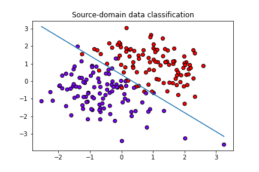
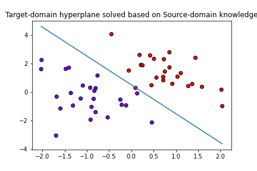

# Homework 3: Machine Learning

> Date: 2022-03-04

## 1. The $\mathcal{L}_2$ Support Vector Machine

The corresponding Lagrange function is 

$$
L=\frac{1}{2}\left\| w \right\| ^2+\frac{C}{2}\sum_i{\xi _{i}^{2}}-\sum_i{\alpha _i\left( y_i\left( w\cdot x_i+b \right) +\xi _i-1 \right)}
$$

Then its dual problem is the max-min problem
$$
\textrm{max}_{\alpha_i} \textrm{ min}_{w,b,\xi_i}L
$$
with the above constraint conditions.

Firstly, to minimize $L$, take the derivative of it in terms of $w$, $b$ and $\xi_i$,

$$
\left\{ \begin{array}{c}
	\frac{\partial L}{\partial w}=w-\sum_i{\alpha _iy_ix_i}=0\\
	\frac{\partial L}{\partial b}=-\sum_i{\alpha _iy_i}=0\\
	\frac{\partial L}{\partial \xi _i}=C\xi _i-\alpha _i=0\\
\end{array} \right. \Rightarrow \left\{ \begin{array}{c}
	w=\sum_i{\alpha _iy_ix_i}\\
	\sum_i{\alpha _iy_i}=0\\
	\xi _i=\frac{\alpha _i}{C}\ge 0\\
\end{array} \right. 
$$

Then replace $w=\sum_i{\alpha _iy_ix_i}$ in the above expression of $L$, we obtain

$$
L=-\frac{1}{2}\sum_{i,j}{\alpha _i\alpha _jy_iy_jx_i\cdot x_j}-\frac{1}{2C}\sum_i{\alpha _{i}^{2}}+\sum_i{\alpha _i}
$$

Thus, the dual problem is as follows:

$$
\textrm{max}_{\alpha_i}L
$$

with constraints

$$
\alpha_i \geq 0, \textrm{ for }\forall \textrm{ }i\\
\sum_i \alpha_i y_i = 0
$$

## 2. Domain Adaptation Support Vector Machines

The corresponding Lagrange function is 

$$
L=\frac{1}{2}\left\| w \right\| ^2+C\sum_i{\xi _i}-Bw_T\cdot w_S-\sum_i{\alpha _i\left( y_i\left( w\cdot x_i+b \right) +\xi _i-1 \right)}-\sum_i{\mu _{\mathrm{i}}\xi _{\mathrm{i}}}
$$

Then its dual problem is the max-min problem
$$
\textrm{max}_{\alpha_i,\mu_i} \textrm{ min}_{w_T,b,\xi_i}L
$$
with the above constraint conditions.

Firstly, to minimize $L$, take the derivative of it in terms of $w_T$, $b$ and $\xi_i$,
$$
\left\{ \begin{array}{c}
	\frac{\partial L}{\partial w_T}=w_T-Bw_S-\sum_i{\alpha _iy_ix_i}=0\\
	\frac{\partial L}{\partial b}=-\sum_i{\alpha _iy_i}=0\\
	\frac{\partial L}{\partial \xi _i}=C-\alpha _i-\mu _i=0\\
\end{array} \right. \Rightarrow \left\{ \begin{array}{c}
	w_T=Bw_S+\sum_i{\alpha _iy_ix_i}\\
	\sum_i{\alpha _iy_i}=0\\
	\alpha_i=C-\mu _i\\
\end{array} \right. 
$$

Since $\mu_i\geq 0$ and $\alpha_i \geq 0$, with the last equation $\alpha_i = C-\mu_i$, the integrated constraint could be expressed as $0 \leq \alpha_i \leq C$.

Then replace $w=Bw_S+\sum_i{\alpha _iy_ix_i}$ in the above expression of $L$, we obtain

$$
L=-\frac{1}{2}\sum_{i,j}{\alpha _i\alpha _jy_iy_jx_i\cdot x_j}-B\sum_i{\alpha _iy_iw_S\cdot x_i}+\sum_i{\alpha _i}+\frac{B^2}{2}\left\| w_S \right\| ^2
\\
$$

Thus, the dual problem is as follows:

$$
\textrm{max}_{\alpha_i}L
$$

with constraints

$$
0 \leq \alpha_i \leq C, \textrm{ for }\forall \textrm{ }i\\
\sum_i \alpha_i y_i = 0
$$

## 3. Domain Adaption SVM (Code)

The implementation is included in the attached `da_svm.py` file, while effect demonstration is included in the attached `hw3.ipynb` file. Brief results are as follows.

Both the origin convex quadratic optimization and the dual optimization approaches are implemented in the code. Results from two approaches are verified almost the same.

